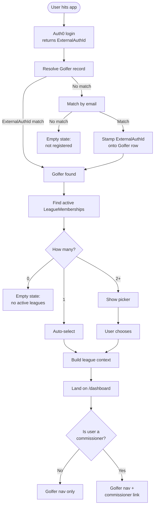

# Auth and League Context

> Canonical reference for how a user goes from "hits the app" to "has a
> resolved league context the rest of the system can rely on."
> Source of truth for the login → context resolution flow.
> Any proposal that changes auth, the resolution rules, or the league
> context shape must update this document as part of its tasks.

## What this document covers

- How identity is established (Auth0)
- How identity is linked to a `Golfer` record
- How a `Golfer` is resolved to one or more `LeagueMembership` records
- How the active league context is selected and represented
- How the context is consumed by the rest of the system

It does **not** cover authorization (what someone can do once their context
is established). See `authorization.md` for that.

## Principles

**Auth0 establishes identity. The app owns everything else.**

Auth0's job ends at "this is a real person and here is their stable
identifier." It is not the source of truth for roles, league membership,
or any business logic. This boundary is intentional — the project spec
calls for the auth provider to be swappable, and that only works if domain
concepts don't leak into auth.

**Roles are per-membership, not per-person.**

A golfer can be a commissioner of one league and a regular member of
another. Roles live on `LeagueMembership.IsCommissioner`. There is no
global "commissioner" role anywhere — not in Auth0, not on `Golfer`, not
in a separate roles table.

**The league context is the implicit scope of every authenticated request.**

Once resolved, every page render and every API call operates within a
single league context. Authorization checks read from it. Data queries
filter by it. The context is built once per session (with the ability to
switch) and re-derived server-side on every request rather than trusted
from the client.

## The resolution flow



### Step 1 — Auth0 login

Standard Auth0 flow. After successful login, the app receives an
`ExternalAuthId` (the Auth0 `sub` claim). This is the only piece of
identity information the app trusts from Auth0.

The app does **not** trust:

- Auth0 user metadata for roles or league membership
- Auth0 app metadata for any domain concept
- Email from Auth0 as a stable key (email is mutable contact info)

`ExternalAuthId` is the stable identity anchor.

### Step 2 — Resolve the Golfer record

Look up the `Golfer` row that corresponds to the authenticated identity.
Two-stage lookup:

1. **Match by `ExternalAuthId`.** If a `Golfer` row already has this
   `ExternalAuthId` set, use it. This is the fast path for returning
   users — one indexed lookup, no further work needed.
2. **Fall back to email match.** If no row matches by `ExternalAuthId`,
   look for a `Golfer` with the same email at the default course. If
   found, re-stamp `ExternalAuthId` with the current sub and use it.

The email fallback handles two cases:

- **First login** — the golfer was pre-provisioned with no
  `ExternalAuthId`. The link happens automatically on first sign-in.
- **Login method change** — the golfer previously logged in via
  email/password (sub `auth0|xxx`) and now logs in via Google (sub
  `google-oauth2|xxx`), or vice versa. Auth0 issues a different `sub`
  per provider; the email fallback finds the existing record and
  re-stamps it with the new sub. From that point on, the fast path
  works for the new login method.

Email is the **stable identity anchor** across auth providers.
`ExternalAuthId` is a cached fast-path lookup that gets updated whenever
the login method changes. Golfers can switch between any Auth0-supported
login method (email/password, Google, etc.) without losing their data.

If neither lookup finds a `Golfer`, the user is authenticated but not
registered at any course. Show an empty "you're not registered to play
in any league" state. Do **not** auto-create a `Golfer` row from an
Auth0 identity — registration is a commissioner action, not a self-serve
flow.

**Edge cases worth knowing about:**

- A `Golfer` row at multiple courses can match the same email. The
  `ExternalAuthId` fast-path lookup is global (any course); the email
  fallback is scoped to the default course. A person playing at multiple
  courses has multiple `Golfer` records, each linked independently.
- The email fallback trusts Auth0's `email` claim as authoritative.
  Auth0 verifies emails for social providers (Google etc.) and enforces
  verification for email/password accounts when configured to do so.

### Step 3 — Find active LeagueMemberships

For all `Golfer` rows resolved in Step 2, find every `LeagueMembership`
that is:

- Not soft-deleted (`ArchivedAt IS NULL`)
- Belongs to a `Season` whose `start_date <= today <= end_date`, OR
  the most recently ended season if no currently active season exists
  (so the dashboard remains useful in the off-season)

This produces a list of candidate memberships.

### Step 4 — Select active membership

Three cases based on the count:

- **Zero candidates** — empty state. The user is registered but not in
  any active or recently ended season. Show "you're not in any active
  leagues right now."
- **One candidate** — auto-select. No UI prompt.
- **Multiple candidates** — show a picker. User selects one. Remember
  the choice (cookie-based for MVP) so the picker doesn't reappear every
  login.

The picker is also reachable from the app shell as a "switch league"
affordance for users in multiple leagues. Switching re-runs Step 4 and
rebuilds the context — no re-authentication required.

### Step 5 — Build the league context

The league context is a server-side object derived on every request:

```
LeagueContext {
  golferId
  leagueMembershipId
  seasonId
  leagueId
  courseId
  isCommissioner
  leagueName
  seasonYear
}
```

`leagueName` and `seasonYear` are denormalised onto the context for display — the dashboard renders them directly without a second lookup.

**`golferName` is not on the context.** The golfer's display name (`FirstName`, `LastName`) lives on the `Golfer` entity and is not denormalised here. Any component that needs the golfer's name for display (e.g., `UserMenu` in the app header) must fetch it separately — call the `/me` API endpoint and join the name from the `Golfer` record. The app layout resolves this with a parallel call alongside `resolveLeagueContext()`.

This is the implicit scope of every page render and API call.

**The context is derived server-side on every request, not trusted from
the client.** The client may pass a hint (a cookie indicating the
preferred membership) but the server re-resolves and validates it. A
client cannot claim to be a commissioner by setting a flag — the
authoritative `IsCommissioner` value is read from the database every
time.

### Step 6 — Render

The user lands on `/dashboard`. The dashboard server component resolves
league context on each render: it reads the `active_membership_id`
cookie as a hint, re-validates it against the database, and either
renders the league name, season year, and commissioner badge, or
redirects to `/pick-league` (multiple candidates), `/me` (no leagues),
or `/login` (unauthenticated). The app shell uses `isCommissioner` from
the context to decide whether to show the `/commissioner` nav link. This
is purely a UI concern — see `authorization.md` for what actually
enforces access to commissioner routes.

## Persistence of the picker choice

The chosen membership is persisted as a cookie (`active_membership_id`
or similar). On each request:

1. Read the cookie
2. Verify the membership still exists, is not archived, and belongs to
   the authenticated golfer
3. If valid, use it as the selected context
4. If invalid (archived, deleted, belongs to another golfer), clear the
   cookie and re-run the picker

The cookie is the **hint**, not the **truth**. The truth is whatever
re-validation determines on each request.

## Switching leagues mid-session

> **Not yet built.** The picker and cookie mechanism are in place; the
> app shell UI to trigger a mid-session switch is planned but not
> implemented.

The intended flow:

1. User clicks a "switch league" control in the app shell
2. They are sent to `/pick-league`, which renders the full candidate list
3. Selecting a membership posts to `/api/context/select`, which updates
   the `active_membership_id` cookie and redirects to `/dashboard`

No re-authentication. No data preservation across the switch — each
context is its own scope.

## Stale context handling

If the active context becomes invalid mid-session (e.g., a commissioner
archives a season the user was in), the next request to a route that
depends on it will fail validation and fall back to re-running the
picker. No global session invalidation, no forced logout — just a lazy
re-resolve.

## What lives where

| Concern | Lives in | Notes |
|---|---|---|
| Identity verification | Auth0 | Username, password, MFA |
| Stable identity ID | `Golfer.ExternalAuthId` | Set on first login via email link |
| Contact email | `Golfer.Email` | Mutable; not used as identity |
| Course affiliation | `Golfer.CourseId` | A golfer is at exactly one course per record |
| League/season participation | `LeagueMembership` | One row per season the golfer plays |
| Role within a league | `LeagueMembership.IsCommissioner` | Per-membership, not per-person |
| Active league selection | Cookie + server validation | Re-derived per request |

## Provider abstraction

Production uses Auth0. The auth integration sits behind an interface so
the provider can be swapped. The interface exposes:

- "Sign in this user" (returns `ExternalAuthId` and email on success)
- "Sign out this user"
- "Get the current authenticated identity" (for server-side rendering
  and API request handling)

A mock provider backs development and tests, allowing instant
"login as" any seeded golfer without going through a real auth flow.
The provider is selected at startup via configuration.

The mock provider is **only** used in development and test environments.
Production builds do not include the mock implementation.

## Pre-provisioning vs. self-provisioning

**Golfers are always pre-provisioned, never self-provisioned.**

A `Golfer` row is created by a commissioner during season setup (or by
SQL during initial league bootstrap). The user then signs up via Auth0
using the email the commissioner entered. On first login, the email
fallback links the Auth0 identity to the existing `Golfer` row.

This is intentional:

- Commissioners know their roster. Self-serve signup would require
  some other gate (invitation codes, league passwords) and add
  complexity.
- The roster exists as data before any golfer logs in. Score entry,
  pairings, and team assignments all work against the roster
  regardless of which golfers have linked their Auth0 identity.
- Identity linkage is automatic and silent — the golfer doesn't need
  to know they're being "linked," it just works.

A separate invitation system handles the "send the golfer an email
telling them they've been added to a league" UX. See the invitation
proposal/doc for that flow.

## Open questions and deferred decisions

- **Course admin role.** Not yet modeled. When added, it will likely
  live as a flag on `Golfer` or as a join entity to `Course`. The
  context shape will gain an `isCourseAdmin` field at that point.
- **Cross-course identity.** The same person at multiple courses has
  multiple `Golfer` rows linked to one `ExternalAuthId`. The picker
  currently treats memberships as the unit of choice; a future
  enhancement could group them by course in the picker UI.
- **Picker persistence beyond cookies.** If users frequently clear
  cookies or use multiple devices, a `last_selected_membership_id`
  column on `Golfer` becomes worth adding. Not needed for MVP.