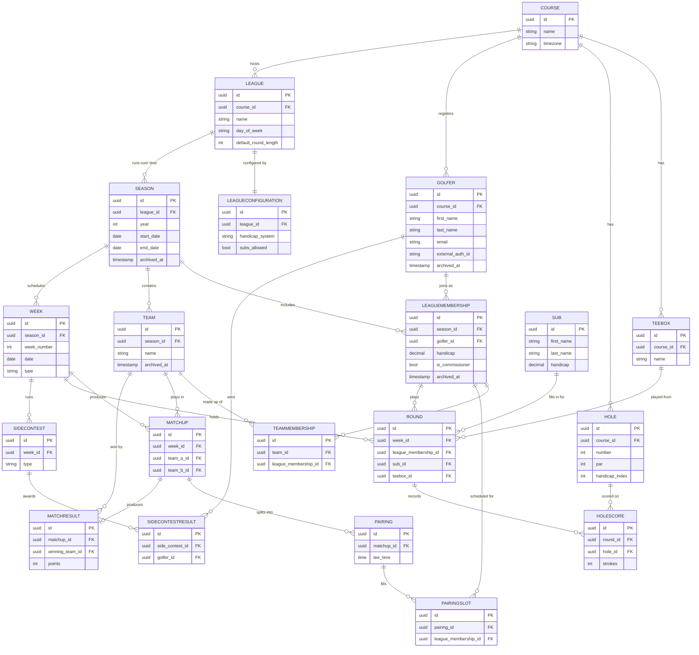

# Data Model

> Canonical reference for the golf league app's data model.
> Source of truth for entities and their relationships.
> Any proposal that adds, removes, or changes entities must update this document
> as part of its tasks.

## ERD

## Entity descriptions

### Course
The top-level organizational unit. A course owns its tee boxes, holes, registered
golfers, and the leagues it hosts. Course-level setup is handled via SQL at MVP.

- `Name`, `TimeZone` — all date and time values are stored in UTC and converted
  to the course's local time at display.

### TeeBox
A set of tees a golfer can play from (forward, middle, back, etc.). Modeled as
a first-class entity from the start so multiple-tee support can be added later
without a migration. At MVP every league defaults to a single tee box.

### Hole
A single hole at a course. Belongs to the course, not the league — the same hole
is shared across every league that plays the course.

- `Number`, `Par`, `HandicapIndex`

### Golfer
A person registered at a course. Persists across seasons — the same golfer can
play multiple seasons of the same league or different leagues at the same course
without duplication.

- `ExternalAuthId` — opaque identifier from the third-party auth provider (Auth0
  at MVP). Abstracted so the auth provider can be swapped without touching other
  entities.

**Constraints:**
- `(CourseId, Email)` is unique — a course cannot have two golfers with the same
  email.
- `(CourseId, ExternalAuthId)` is unique when `ExternalAuthId` is not null — a
  single auth identity cannot be linked to two golfer records at the same course.
- `ExternalAuthId` is **not** globally unique — the same person may legitimately
  have golfer records at multiple courses.
- `Email` is mutable contact info, not identity. `ExternalAuthId` is the stable
  identity anchor.

### League
A specific competitive grouping at a course (e.g., "Tuesday Night Men's League").
A league spans multiple seasons over time.

- `DayOfWeek`, `DefaultRoundLength` (9 or 18, configurable per league)

### LeagueConfiguration
One-to-one with `League`. Holds the configurable rules that govern how the
league plays.

- `HandicapSystem` — `None` or `LeagueEstablished` at MVP. `GHIN` and others
  post-MVP.
- `SubsAllowed` — boolean. Subs are allowed at MVP by default.

This table starts small and grows as new league-level options land. Each new
option arrives as its own migration with a clear default for existing leagues.

### Season
A single year or run of a league. The container for everything that happens in
one playing year — memberships, teams, weeks, matchups, and results.

### LeagueMembership
Joins a `Golfer` to a specific `Season`. Carries the golfer's handicap for that
season as a snapshot, so historical results stay accurate even as a golfer's
handicap changes over time.

- `IsCommissioner` — boolean. Marks this membership as the commissioner for the
  season. A commissioner is also a regular member who plays in the league; the
  flag adds elevated permissions, it does not change anything else about the
  membership. Multiple flagged memberships in the same season represent
  co-commissioners.

### Team
A pair (or group) of golfers playing together within a season. Teams are locked
once a season starts at MVP; mid-season team changes are post-MVP.

### TeamMembership
Joins a `LeagueMembership` to a `Team`. A golfer can only be on one team per
season.

### Week
A scheduled play date within a season.

- `Type` — `Regular`, `FunWeek`, or `MakeupDay`. Regular weeks generate matchups
  that count toward standings. Fun weeks are reserved tee times outside the
  regular schedule and do not affect standings.

### Matchup
Two teams scheduled to play each other on a regular week. Manually created by
the commissioner at MVP. Auto-generated matchups are post-MVP.

### Pairing
The actual foursome (or smaller group) that plays together at a specific tee
time. A matchup typically has one pairing but the model allows for splits.

- `TeeTime` — supports leagues that run multiple tee times in a single play day
  (more serious leagues with larger fields).

### PairingSlot
Joins a `LeagueMembership` to a `Pairing`. Represents who was scheduled to play.
Actual play is recorded on `Round`, which may reference a sub if the scheduled
golfer didn't show.

### Round
An individual golfer's play on a specific week. Carries either a
`LeagueMembershipId` (the regular member played) or a `SubId` (a sub played in
their place) — exactly one of the two is populated.

- `TeeBoxId` — which tees the round was played from (defaults to the league's
  configured tee box).

### HoleScore
A single hole's score within a round. Hole-by-hole granularity is required at
MVP to support skins, closest-to-the-pin, and accurate handicap calculation.

- `Strokes` — gross (raw) strokes on the hole. **Nullable** to support
  did-not-finish and no-score situations.

Handicap-adjusted scores are **not stored** — they are computed on read using
the league's handicap rules, the golfer's seasonal handicap, and the hole's
handicap index. See "Score handling" below.

### Sub
A non-member who fills in for a regular golfer for one round. Lightweight —
just a name and a handicap entered by the commissioner. Subs do not have logins
and do not persist across seasons. The sub's handicap is captured at the time
of play for that round only.

### MatchResult
The outcome of a matchup. Derived from the rounds played, but stored separately
so:

- standings queries stay fast
- the commissioner can override a result when needed
- the standings calculation stays decoupled from the weekly scoring format

`WinningTeamId` is nullable to support ties.

### SideContest
A contest run on a specific week (skins, closest to the pin, longest drive,
etc.). Pluggable by `Type` so new contest formats can be added without modifying
existing logic.

### SideContestResult
The winner(s) of a side contest. References the `Golfer` rather than the
`LeagueMembership` so contests can later be expanded to cross-league or
season-spanning contests if needed.

## Roles and permissions

The app has four role tiers. They are stored in different places in the model:

- **Super Admin** — owns the software. Not modeled in the database. Operates via
  direct SQL access at MVP.
- **Course Admin** — manages leagues at a single course. **Intentionally
  deferred** until a course admin UI is built. When added, will likely live as
  a flag on `Golfer` or as a join entity to `Course`.
- **Commissioner** — runs a specific league/season. Stored as `IsCommissioner`
  on `LeagueMembership`. A commissioner is also a regular member.
- **Golfer** — implicit. Any record in `Golfer` is a golfer.

**Authority boundary between course admin and commissioner:** the course admin
owns the schedule (Weeks, dates, tee times, makeup days). The commissioner owns
gameplay within a Week (matchups, pairings, scores, results, side contests).
This boundary will be enforced when the course admin role is implemented.

## Score handling

**Gross scores are stored, adjusted scores are computed.**

- `HoleScore.Strokes` holds the gross score.
- Net / handicap-adjusted scores are calculated on read by a service that knows
  the league's handicap system, the golfer's seasonal handicap, and the hole's
  handicap index.
- This keeps the model simple and avoids stale-stored-value bugs when handicap
  rules change.

If a finalized result ever needs to be insulated from later rule changes (e.g.,
a championship outcome that should not retroactively change), an adjusted-score
snapshot can be stored on `MatchResult` at the time it is finalized. This is
deferred until needed.

## Soft delete and historical data

The following entities use soft delete via a nullable `ArchivedAt` timestamp:

- `Golfer`
- `LeagueMembership`
- `Team`
- `Season`

Hard deletion of these records would orphan years of historical results
(rounds, scores, standings). Soft delete keeps the operational database clean
while preserving the history all those references depend on.

Other entities (rounds, scores, matchups, results) are append-only by nature
and do not need soft delete — they are not deleted in normal operation.

If the system grows large enough that retention becomes a concern, archived
data can be migrated to a data warehouse without disturbing the operational
model.

## Audit fields

Every entity carries `CreatedAt` and `UpdatedAt` timestamps.

Entities that are commissioner-edited additionally carry `CreatedBy` and
`UpdatedBy` references to a `LeagueMembership` (so attribution survives even
when permissions change later):

- `Round`
- `HoleScore`
- `Pairing`
- `Matchup`
- `MatchResult`

These are not shown in the ERD above to keep it readable but are present on every
table.

## Money is out of scope

The app records who won what — it does not move money, hold balances, or
process payments. League dues, skins pots, and prize payouts are handled
out-of-band by the commissioner (Venmo, cash, check).

This is an intentional design choice that avoids:

- PCI compliance
- Payment processor integrations
- Tax reporting obligations
- State-by-state gambling and prize-pool regulations
- Money transmission licensing

If lightweight non-financial accounting is ever needed (e.g., "Adam owes the
skins pot $5"), it can be added as ledger-style records that track amounts
without any actual money flow through the system.

## Known constraints and accepted limitations

**Team-based play is assumed.** The model is built around `Team` and
`Matchup` between teams. Individual-format leagues (no teams) are handled by
creating one-person teams. This is awkward but workable; a future proposal
could remove teams as a hard requirement if individual leagues become a
priority.

**Sub-to-regular promotion is not modeled.** If a sub plays often enough that
the league wants to make them a regular member, they are entered as a new
`Golfer`. Their prior `Round` records remain linked to the `Sub` record and
are not associated with the new `Golfer`. Historical sub rounds remain
anonymous. This is accepted as a rare edge case.

## Notes on key design decisions

**Golfer continuity across seasons.** The same person at the same course is one
`Golfer` record with many `LeagueMembership` records over time. This preserves
handicap history, identity, and login across years.

**Snapshot handicaps on LeagueMembership.** A golfer's handicap evolves; storing
the season-specific value on the membership keeps historical results accurate
without complicated as-of queries.

**Sub as a separate entity.** Subs are not members and don't have logins. Keeping
them separate from `Golfer` keeps the membership model clean. A `Round` references
either a membership or a sub, never both.

**Course owns tee boxes and holes.** These don't change when leagues do, so they
live at the course level and are shared across all leagues at that course.

**MatchResult is materialized, not derived on read.** Trades a small amount of
storage and write complexity for fast standings queries and the ability to
override results when needed.

**LeagueConfiguration is a typed table, not JSONB.** Each new option is an
explicit migration with a clear default. JSONB stays available as a fallback if
the option count ever balloons.