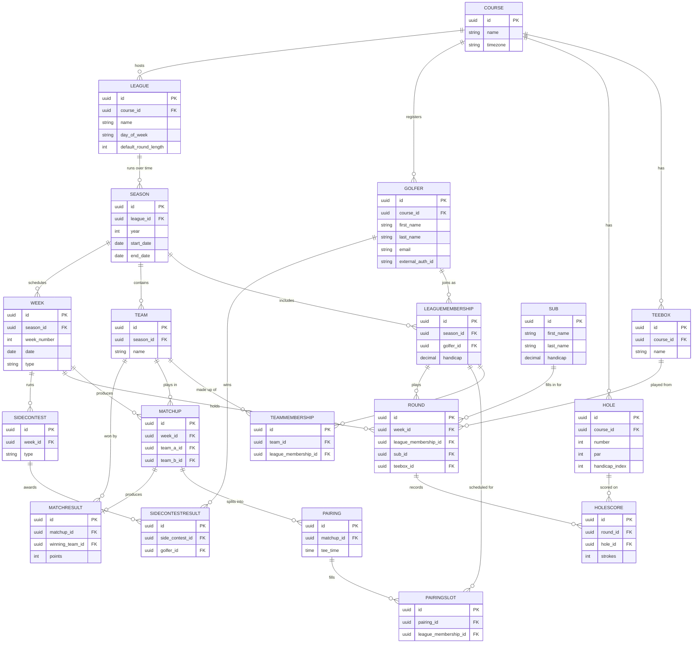

# Data Model

> Canonical reference for the golf league app's data model.
> Source of truth for entities and their relationships.
> Any proposal that adds, removes, or changes entities must update this document
> as part of its tasks.

## ERD

## Entity descriptions

### Course
The top-level organizational unit. A course owns its tee boxes, holes, registered
golfers, and the leagues it hosts. Course-level setup is handled via SQL at MVP.

- `Name`, `TimeZone` — all date and time values are stored in UTC and converted
  to the course's local time at display.

### TeeBox
A set of tees a golfer can play from (forward, middle, back, etc.). Modeled as
a first-class entity from the start so multiple-tee support can be added later
without a migration. At MVP every league defaults to a single tee box.

### Hole
A single hole at a course. Belongs to the course, not the league — the same hole
is shared across every league that plays the course.

- `Number`, `Par`, `HandicapIndex`

### Golfer
A person registered at a course. Persists across seasons — the same golfer can
play multiple seasons of the same league or different leagues at the same course
without duplication.

- `ExternalAuthId` — opaque identifier from the third-party auth provider (Auth0
  at MVP). Abstracted so the auth provider can be swapped without touching other
  entities.

### League
A specific competitive grouping at a course (e.g., "Tuesday Night Men's League").
A league spans multiple seasons over time.

- `DayOfWeek`, `DefaultRoundLength` (9 or 18, configurable per league)

### Season
A single year or run of a league. The container for everything that happens in
one playing year — memberships, teams, weeks, matchups, and results.

### LeagueMembership
Joins a `Golfer` to a specific `Season`. Carries the golfer's handicap for that
season as a snapshot, so historical results stay accurate even as a golfer's
handicap changes over time.

### Team
A pair (or group) of golfers playing together within a season. Teams are locked
once a season starts at MVP; mid-season team changes are post-MVP.

### TeamMembership
Joins a `LeagueMembership` to a `Team`. A golfer can only be on one team per
season.

### Week
A scheduled play date within a season.

- `Type` — `Regular`, `FunWeek`, or `MakeupDay`. Regular weeks generate matchups
  that count toward standings. Fun weeks are reserved tee times outside the
  regular schedule and do not affect standings.

### Matchup
Two teams scheduled to play each other on a regular week. Manually created by
the commissioner at MVP. Auto-generated matchups are post-MVP.

### Pairing
The actual foursome (or smaller group) that plays together at a specific tee
time. A matchup typically has one pairing but the model allows for splits.

### PairingSlot
Joins a `LeagueMembership` to a `Pairing`. Represents who was scheduled to play.
Actual play is recorded on `Round`, which may reference a sub if the scheduled
golfer didn't show.

### Round
An individual golfer's play on a specific week. Carries either a
`LeagueMembershipId` (the regular member played) or a `SubId` (a sub played in
their place) — exactly one of the two is populated.

- `TeeBoxId` — which tees the round was played from (defaults to the league's
  configured tee box).

### HoleScore
A single hole's score within a round. Hole-by-hole granularity is required at
MVP to support skins, closest-to-the-pin, and accurate handicap calculation.

### Sub
A non-member who fills in for a regular golfer for one round. Lightweight —
just a name and a handicap entered by the commissioner. Subs do not have logins
and do not persist across seasons. The sub's handicap is captured at the time
of play for that round only.

### MatchResult
The outcome of a matchup. Derived from the rounds played, but stored separately
so:

- standings queries stay fast
- the commissioner can override a result when needed
- the standings calculation stays decoupled from the weekly scoring format

`WinningTeamId` is nullable to support ties.

### SideContest
A contest run on a specific week (skins, closest to the pin, longest drive,
etc.). Pluggable by `Type` so new contest formats can be added without modifying
existing logic.

### SideContestResult
The winner(s) of a side contest. References the `Golfer` rather than the
`LeagueMembership` so contests can later be expanded to cross-league or
season-spanning contests if needed.

## Notes on key design decisions

**Golfer continuity across seasons.** The same person at the same course is one
`Golfer` record with many `LeagueMembership` records over time. This preserves
handicap history, identity, and login across years.

**Snapshot handicaps on LeagueMembership.** A golfer's handicap evolves; storing
the season-specific value on the membership keeps historical results accurate
without complicated as-of queries.

**Sub as a separate entity.** Subs are not members and don't have logins. Keeping
them separate from `Golfer` keeps the membership model clean. A `Round` references
either a membership or a sub, never both.

**Course owns tee boxes and holes.** These don't change when leagues do, so they
live at the course level and are shared across all leagues at that course.

**MatchResult is materialized, not derived on read.** Trades a small amount of
storage and write complexity for fast standings queries and the ability to
override results when needed.